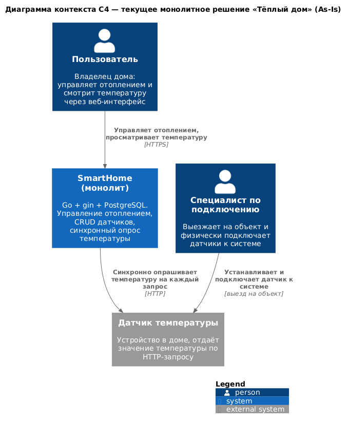
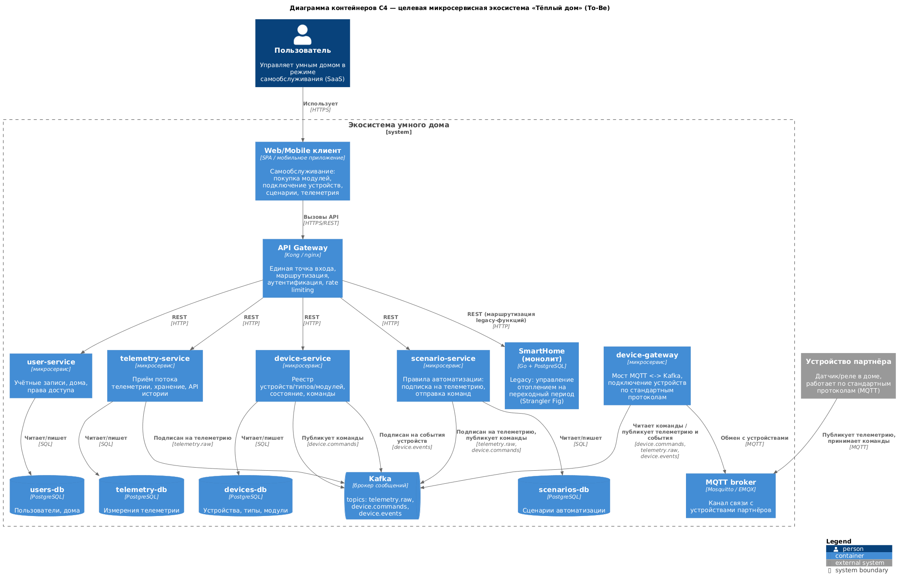
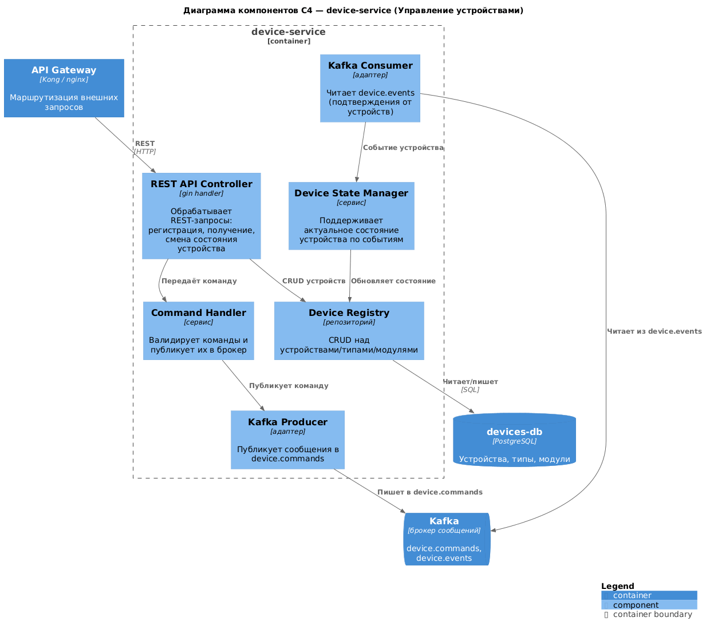
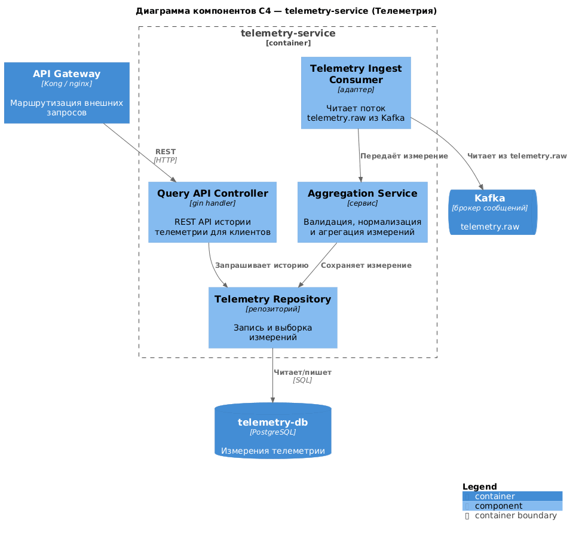
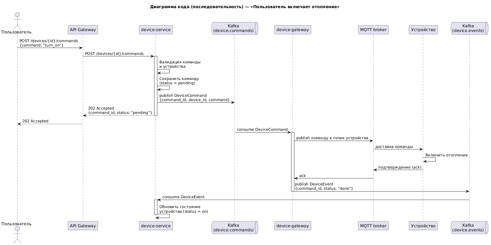
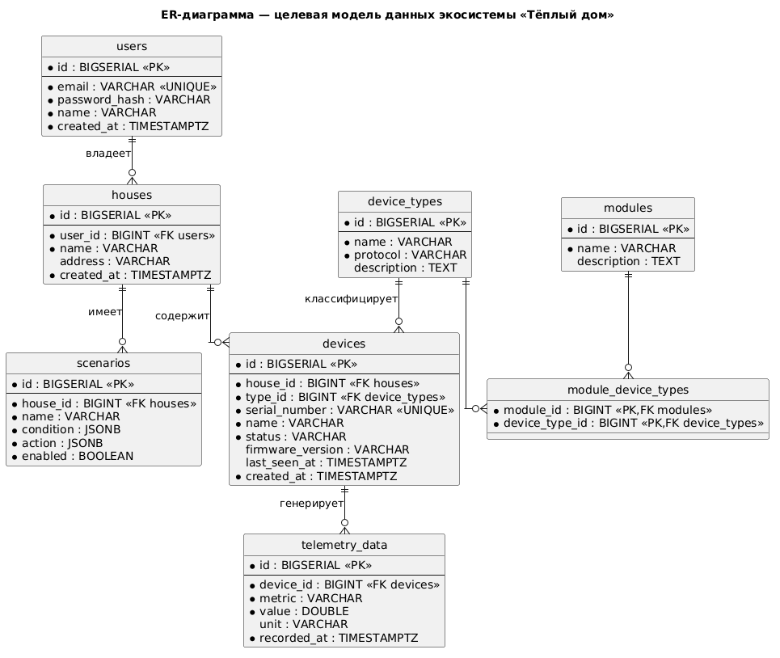

# Проектная работа 1 спринта — «Тёплый дом»

Решение проектной работы: анализ монолита, проектирование целевой микросервисной
архитектуры (C4), ER-диаграмма, документация API и приложение temperature-api с
docker-compose. Структура файла повторяет структуру заданий.

# Задание 1. Анализ и планирование

### 1. Описание функциональности монолитного приложения

**Управление отоплением:**

- Пользователи могут удалённо включать и выключать отопление в своих домах через веб-интерфейс.
- Система хранит датчики (реле/сенсоры) в таблице `sensors` и предоставляет их CRUD через REST API `/api/v1/sensors`.
- Установка и подключение оборудования к системе выполняется только с выездом специалиста; самостоятельное подключение датчика пользователем не предусмотрено.

**Мониторинг температуры:**

- Система получает данные о температуре с датчиков, установленных в домах, и показывает пользователю текущее значение через веб-интерфейс.
- Данные о температуре запрашиваются синхронно: на каждый запрос списка датчиков сервер опрашивает внешний датчик (`GET /temperature/{id}`) и подставляет актуальное значение в ответ.
- Опрос идёт только в направлении «сервер → датчик»; асинхронного потока телеметрии от устройств нет.

### 2. Анализ архитектуры монолитного приложения

- **Язык программирования:** Go 1.22, веб-фреймворк gin.
- **База данных:** PostgreSQL 16, одна база `smarthome` с таблицей `sensors`.
- **Архитектура:** монолит — обработка HTTP-запросов, бизнес-логика и работа с данными находятся в одном приложении и разворачиваются одним контейнером.
- **Взаимодействие:** полностью синхронное. Цепочка «HTTP-запрос пользователя → опрос датчика сервером → ответ» выполняется последовательно; асинхронных вызовов, брокеров сообщений и реактивного взаимодействия нет.
- **Масштабируемость:** ограничена — монолит масштабируется только целиком, отдельные функции (например мониторинг температуры) масштабировать нельзя.
- **Развёртывание:** требует остановки всего приложения (даунтайм при каждом обновлении).

### 3. Определение доменов и границы контекстов

Основной домен (core domain) — **«Управление умным домом»**.

**Границы контекстов As-Is** (текущий монолит):

- **Управление отоплением** — включение/выключение отопления.
- **Мониторинг температуры** — получение и отображение температуры с датчиков.

**Границы контекстов To-Be** (целевая экосистема):

- **Пользователи и дома** — учётные записи, дома, права доступа.
- **Управление устройствами** — реестр устройств, типов и продаваемых модулей, состояние, команды.
- **Телеметрия** — приём, хранение и выдача истории показаний устройств.
- **Сценарии автоматизации** — правила «если телеметрия … то команда …».
- **Подключение устройств** — мост к устройствам партнёров по стандартным протоколам (MQTT).

### 4. Проблемы монолитного решения

- Масштабирование только целиком: нельзя выделить ресурсы под нагруженный контекст (телеметрия), не масштабируя всё приложение.
- Развёртывание = даунтайм: обновление требует остановки всей системы.
- Жёсткая синхронная связность с датчиками: сервер опрашивает датчик на каждый запрос, что даёт задержки и риск каскадных отказов при недоступности устройства.
- Добавление нового типа устройства (свет, ворота, наблюдение) требует изменения и повторного развёртывания всего монолита.
- Единая база данных — узкое место и точка отказа для всех функций сразу.
- Нет самообслуживания: подключение датчика невозможно без выезда специалиста, что противоречит целевой SaaS-модели.
- Одна кодовая база и одна команда блокируют параллельную разработку разных функциональных направлений.

### 5. Визуализация контекста системы — диаграмма C4

Диаграмма контекста текущего монолитного решения (As-Is):



Исходник PlantUML: [schemas/c4-context-asis.puml](schemas/c4-context-asis.puml)

# Задание 2. Проектирование микросервисной архитектуры

**Декомпозиция.** На основе выделенных To-Be контекстов система разбита на микросервисы —
по одному сервису на контекст плюс инфраструктурные контейнеры. Монолит на переходный
период сохраняется за API Gateway и постепенно замещается сервисами (паттерн Strangler Fig).
В качестве брокера сообщений выбрана **Kafka** — она хорошо подходит для высокопоточного
потока телеметрии от множества устройств. Связь с устройствами партнёров идёт по стандартному
протоколу **MQTT** через отдельный контейнер device-gateway, который выступает мостом MQTT ↔ Kafka.

| Контейнер | Ответственность | Хранилище |
|---|---|---|
| Web/Mobile клиент | UI самообслуживания | — |
| API Gateway | вход, маршрутизация, аутентификация | — |
| user-service (Пользователи и дома) | учётные записи, дома, права доступа | PostgreSQL (users-db) |
| device-service (Управление устройствами) | реестр устройств/типов/модулей, состояние, команды | PostgreSQL (devices-db) |
| telemetry-service (Телеметрия) | приём потока телеметрии, хранение, API истории | PostgreSQL (telemetry-db) |
| scenario-service (Сценарии) | правила автоматизации: подписка на телеметрию → команды | PostgreSQL (scenarios-db) |
| device-gateway | мост MQTT ↔ Kafka: подключение устройств по стандартным протоколам | — |
| Kafka (брокер) | topics: `telemetry.raw`, `device.commands`, `device.events` | — |
| MQTT broker | канал связи с устройствами партнёров | — |

**Взаимодействие.** Синхронный REST через API Gateway используется для CRUD и запросов
(клиенту нужен немедленный ответ). Асинхронно через Kafka: device-service публикует команды в
`device.commands` → device-gateway доставляет их устройству по MQTT; устройство шлёт телеметрию по
MQTT → device-gateway публикует её в `telemetry.raw` → её читают telemetry-service (сохраняет) и
scenario-service (проверяет правила и при срабатывании публикует новые команды в `device.commands`).

**Диаграмма контейнеров (Containers)**



Исходник: [schemas/c4-container-tobe.puml](schemas/c4-container-tobe.puml)

**Диаграмма компонентов (Components)**

Диаграммы компонентов приведены для двух ключевых микросервисов — device-service и
telemetry-service; остальные сервисы устроены аналогично (REST-контроллер, доменные сервисы,
репозиторий над своей БД, адаптеры Kafka).

device-service (Управление устройствами):



Исходник: [schemas/c4-component-device-service.puml](schemas/c4-component-device-service.puml)

telemetry-service (Телеметрия):



Исходник: [schemas/c4-component-telemetry-service.puml](schemas/c4-component-telemetry-service.puml)

**Диаграмма кода (Code)**

Диаграмма последовательности для критичного сценария «Пользователь включает отопление»:
синхронный ответ 202 после публикации команды в брокер и последующее асинхронное подтверждение
от устройства.



Исходник: [schemas/c4-code-send-command.puml](schemas/c4-code-send-command.puml)

# Задание 3. Разработка ER-диаграммы



Исходник: [schemas/er-diagram.puml](schemas/er-diagram.puml)

Модель включает сущности: `users` (пользователи), `houses` (дома), `device_types` (типы
устройств), `modules` (продаваемые комплекты), `devices` (устройства), `telemetry_data`
(телеметрия) и `scenarios` (сценарии автоматизации), а также связующую таблицу
`module_device_types`. Представлены все три типа связей:

- **один-ко-многим (1:N):** пользователь → дома, дом → устройства, тип устройства → устройства, дом → сценарии, устройство → записи телеметрии;
- **многие-ко-многим (M:N):** модули ↔ типы устройств (через таблицу `module_device_types`);
- **один-к-одному (1:1):** реализуется через уникальные ключи (`users.email`, `devices.serial_number`).

# Задание 4. Создание и документирование API

### 1. Тип API

Используются два типа API — под характер взаимодействия:

- **REST (OpenAPI 3.0)** — для синхронных операций микросервиса **device-service**: регистрация
  устройства (самообслуживание), получение информации, смена состояния, отправка команды и чтение
  истории телеметрии. Здесь клиенту нужен немедленный ответ на запрос.
- **AsyncAPI (Kafka)** — для асинхронного обмена событиями: поток телеметрии (`telemetry.raw`) и
  команды устройствам (`device.commands`). Отправителю не нужно ждать ответа немедленно, поэтому
  используется брокер сообщений.

### 2. Документация API

- REST device-service (OpenAPI 3.0.3): [api/device-service.openapi.yaml](api/device-service.openapi.yaml).
  Эндпойнты: `POST /devices`, `GET /devices/{deviceId}`, `PATCH /devices/{deviceId}/state`,
  `POST /devices/{deviceId}/commands`, `GET /devices/{deviceId}/telemetry`. Для каждого эндпойнта
  описаны форматы запроса/ответа, коды ответа (200/201/202/400/404/409/422/500) и примеры в блоках `examples`.
- Асинхронные события (AsyncAPI 2.6.0): [api/telemetry-events.asyncapi.yaml](api/telemetry-events.asyncapi.yaml).
  Каналы `telemetry.raw` (сообщение `TelemetryEvent`) и `device.commands` (сообщение `DeviceCommand`) с примерами.

Спецификации можно открыть в [Swagger Editor](https://editor.swagger.io/) (OpenAPI) и
[AsyncAPI Studio](https://studio.asyncapi.com/) (AsyncAPI).

# Задание 5. Работа с docker и docker-compose

Реализовано приложение **temperature-api** ([apps/temperature_api/](apps/temperature_api/)),
имитирующее удалённый датчик температуры.

- **Язык:** Go (стандартная библиотека `net/http`, без внешних зависимостей).
- **Эндпойнты:**
  - `GET /temperature?location=&sensorId=` — значение температуры по названию комнаты;
  - `GET /temperature/{id}` — значение по идентификатору датчика (используется монолитом в `GetSensors`);
  - `GET /health` — проверка живости.
- Недостающее поле выводится из заданного по маппингу `1↔Living Room`, `2↔Bedroom`, `3↔Kitchen`
  (иначе `Unknown`/`0`). Значение температуры — случайное число в диапазоне `[18.0, 28.0)`, поэтому
  при каждом вызове оно разное. Формат JSON-ответа совпадает с контрактом, который ожидает монолит
  (`services.TemperatureResponse`).
- **Порт:** 8081 (по умолчанию, настраивается через переменную `PORT`).
- **Docker:** двухстадийный `Dockerfile` (`golang:1.22-alpine` → `alpine:latest`).

В `apps/docker-compose.yml` заполнены два сервиса:

- **postgres** (`postgres:16-alpine`) — БД для монолита: пользователь/пароль `postgres`, healthcheck
  через `pg_isready`, скрипт инициализации `./smart_home/init.sql` смонтирован в
  `/docker-entrypoint-initdb.d/`. Переменная `POSTGRES_DB` намеренно не задаётся: скрипт сам
  выполняет `CREATE DATABASE smarthome`.
- **temperature-api** — сборка из `./temperature_api`, порт `8081:8081`.

**Запуск и проверка:**

```bash
cd apps
docker compose up -d --build
# temperature-api: разное значение при каждом вызове
curl 'http://localhost:8081/temperature?location=Kitchen'
# монолит (Postman: Create Sensor, затем Get All Sensors — значение температуры меняется)
curl -X POST http://localhost:8080/api/v1/sensors -H 'Content-Type: application/json' \
  -d '{"name":"Living Room Temperature","type":"temperature","location":"Living Room","unit":"°C"}'
curl http://localhost:8080/api/v1/sensors
```

# **Задание 6. Разработка MVP**

Необходимо создать новые микросервисы и обеспечить их интеграции с существующим монолитом для плавного перехода к микросервисной архитектуре. 

### **Что нужно сделать**

1. Создайте новые микросервисы для управления телеметрией и устройствами (с простейшей логикой), которые будут интегрированы с существующим монолитным приложением. Каждый микросервис на своем ООП языке.
2. Обеспечьте взаимодействие между микросервисами и монолитом (при желании с помощью брокера сообщений), чтобы постепенно перенести функциональность из монолита в микросервисы. 

В результате у вас должны быть созданы Dockerfiles и docker-compose для запуска микросервисов. 